<table>
  <tr>
    <td rowspan="4"></td>
    <td>Instituto Federal de Educação, Ciência e Tecnologia do Maranhão</td>
  </tr>
  <tr>
    <td>Disciplina: Redes de Computadores I</td>
  </tr>
  <tr>
    <td>Professor: <a href="https://github.com/agenteph">Paulo Henrique Barbosa</a></td>
  </tr>
  <tr>
    <td>Aluno: Israel Jorge de Sousa</td>
  </tr>
</table>

# Introdução

Esta Wiki apresenta o projeto de simulação de rede desenvolvido para disciplina de Redes de Computadores I. O principal objetivo deste projeto é proporcionar uma experiência prática abrangente na configuração e administração de uma rede de computadores. O ambiente de simulação será construído utilizando a ferramenta Cisco Packet Tracer, que oferece a oportunidade de aplicar de maneira concreta os conhecimentos adquiridos ao longo da disciplina de Redes de Computadores I.

### Cenário proposto - 1 parte

Na Empresa EHNOS, o proprietário expressou o desejo de conectar todos os computadores da empresa em uma rede com acesso à internet. Para solucionar esse desafio, você foi contratado como responsável pela tecnologia para organizar e montar toda a rede.

O proprietário informou que são 25 computadores e solicitou a você a lista de requisitos para montar a rede, o layout completo da estrutura e uma rede eficiente para a transferência de grandes volumes de arquivos.

#### Notas Importantes:

- **A rede deverá ter endereços LAN das três classes:**

  - Rede 1 (Classe A) - 10 computadores.
  - Rede 2 (Classe B) - 10 computadores.
  - Rede 3 (Classe C) - 5 computadores.

- **Interligar cada rede com 2 HUB's e 3 Switch's;**

  - 2 HUBs e 3 Switch's para interligar as redes.

- **Realizar os testes de Ping entre todos os computadores.**

## Equipamentos utilizados

- 25 computadores com o sistema operacional Windows com portas de rede Gigabit Ethernet.
- 2 Hubs com 4 com portas de rede Gigabit Ethernet.
- 3 Switch's Multi-Layer com portas de rede Gigabit Ethernet.
- 1 Roteador com 3 placas de rede Gigabit Ethernet.

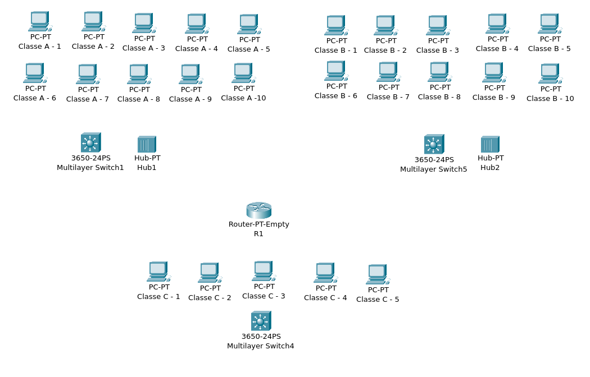

Todos os equipamentos foram modificados para possuírem portas de rede Gigabit Ethernet pois o cliente quer uma rede eficiente para a transferência de grandes volumes de arquivos.

## Organização dos Dispositivos

A estrutura da rede foi projetada seguindo o modelo de topologia estrela, no qual os Switch's desempenharam o papel centralizador para cada grupo de classe. Os dispositivos foram organizados e conectados diretamente por meio de cabos.

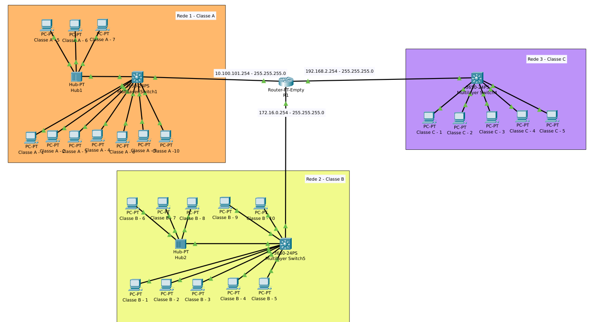

#### Configuração da Rede 1

Os computadores da Rede 1 foram configurados para rede 10.100.101.0/24 com Ip's de Classe A de 10.100.101.2 a 10.100.101.11

  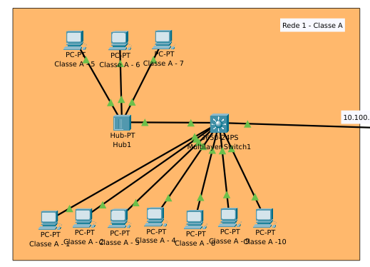
  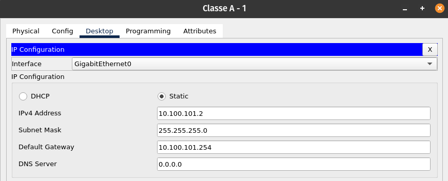

#### Configuração da Rede 2

Os computadores da Rede 2 foram configurados para rede 172.16.0.0/24 com Ip's de Classe A de 172.16.0.2 a 172.16.0.11

  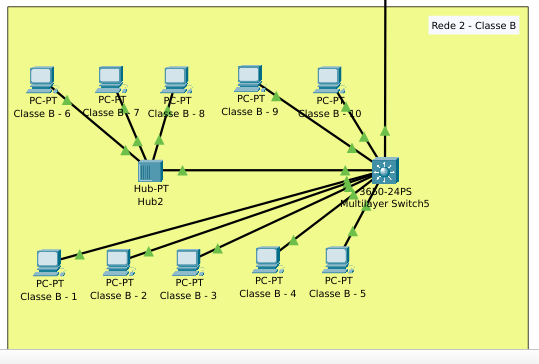
  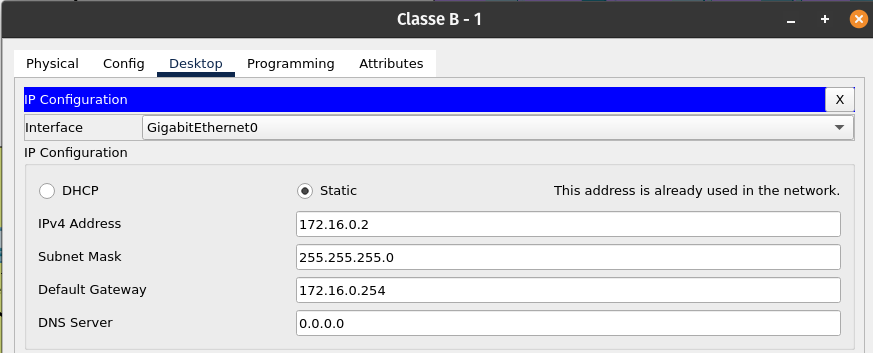

#### Configuração da Rede 3

Os computadores da Rede 3 foram configurados para rede 192.168.2.0/24 com Ip's de Classe A de 192.168.2.2 a 192.168.2.6

  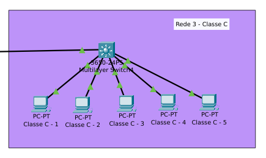
  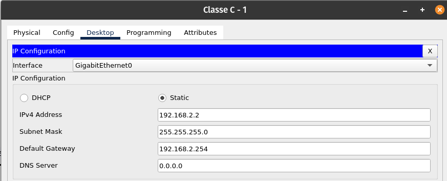

#### Conectando as três Redes

Para interligar as três redes foi empregado um roteador para interligar as três redes, desempenhando o papel de gateway. Cada rede estabelece conexão com o roteador através de uma porta, conforme a seguinte configuração:

 <ul>
 <li style="margin-bottom:30px;">
  Rede 1 (Classe A)
   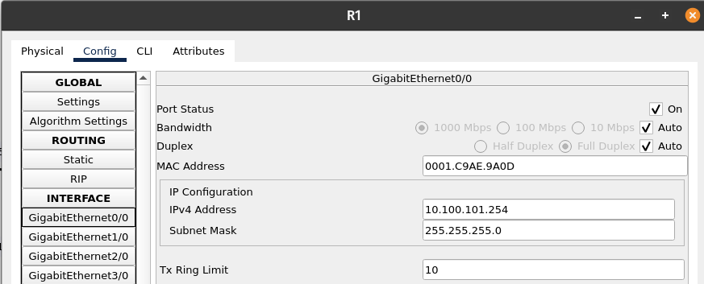
 </li>

 <li style="margin-bottom:30px;">
  Rede 2 (Classe B)
    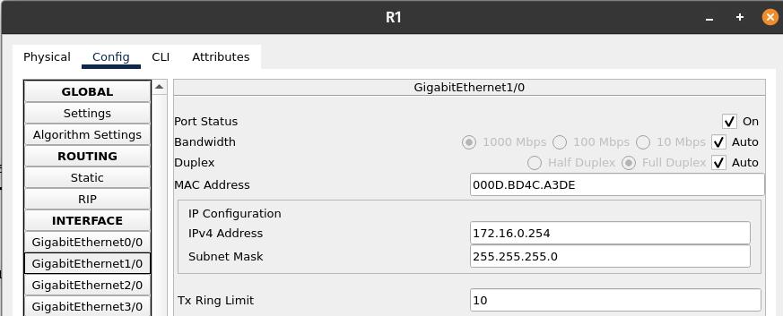
 </li>

 <li>
  Rede 3 (Classe C)
    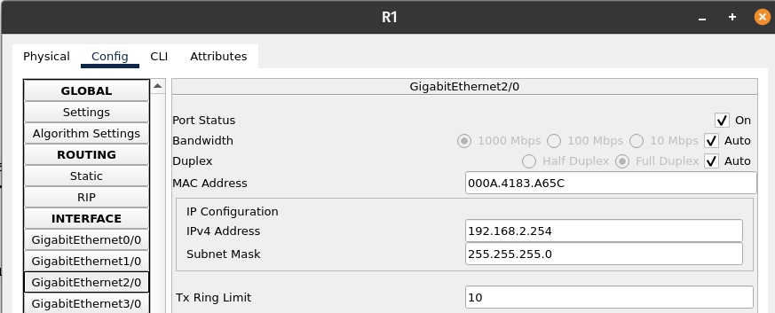
 </li>
 
 </ul>

