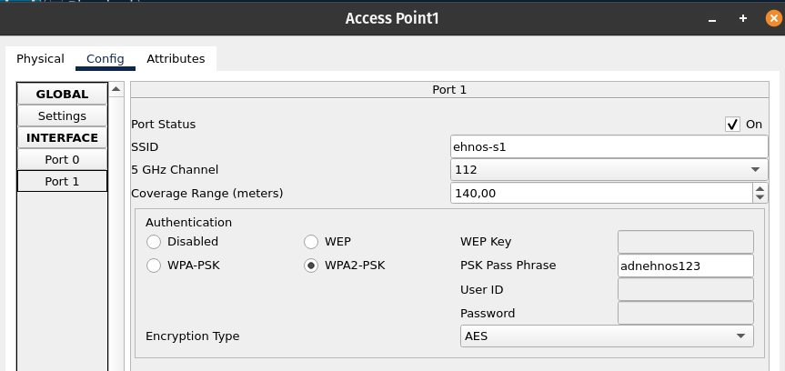

<table>
  <tr>
    <td rowspan="4"></td>
    <td>Instituto Federal de Educação, Ciência e Tecnologia do Maranhão</td>
  </tr>
  <tr>
    <td>Disciplina: Redes de Computadores I</td>
  </tr>
  <tr>
    <td>Professor: <a href="https://github.com/agenteph">Paulo Henrique Barbosa</a></td>
  </tr>
  <tr>
    <td>Aluno: Israel Jorge de Sousa</td>
  </tr>
</table>

# Introdução

Esta Wiki apresenta o projeto de simulação de rede desenvolvido para disciplina de Redes de Computadores I. O principal objetivo deste projeto é proporcionar uma experiência prática abrangente na configuração e administração de uma rede de computadores. O ambiente de simulação será construído utilizando a ferramenta Cisco Packet Tracer, que oferece a oportunidade de aplicar de maneira concreta os conhecimentos adquiridos ao longo da disciplina de Redes de Computadores I.

### Cenário proposto - 1 parte

Na Empresa EHNOS, o proprietário expressou o desejo de conectar todos os computadores da empresa em uma rede com acesso à internet. Para solucionar esse desafio, você foi contratado como responsável pela tecnologia para organizar e montar toda a rede.

O proprietário informou que são 25 computadores e solicitou a você a lista de requisitos para montar a rede, o layout completo da estrutura e uma rede eficiente para a transferência de grandes volumes de arquivos.

#### Notas Importantes:

- **A rede deverá ter endereços LAN das três classes:**

  - Rede 1 (Classe A) - 10 computadores.
  - Rede 2 (Classe B) - 10 computadores.
  - Rede 3 (Classe C) - 5 computadores.

- **Interligar cada rede com 2 HUB's e 3 Switch's;**

  - 2 HUBs e 3 Switch's para interligar as redes.

- **Realizar os testes de Ping entre todos os computadores.**

## Equipamentos utilizados

- 25 computadores com o sistema operacional Windows com portas de rede Gigabit Ethernet.
- 2 Hubs com 4 com portas de rede Gigabit Ethernet.
- 3 Switch's Multi-Layer com portas de rede Gigabit Ethernet.
- 1 Roteador com 3 placas de rede Gigabit Ethernet.

Todos os equipamentos foram modificados para possuírem portas de rede Gigabit Ethernet pois o cliente quer uma rede eficiente para a transferência de grandes volumes de arquivos.

## Organização dos Dispositivos

A estrutura da rede foi projetada seguindo o modelo de topologia estrela, no qual os Switch's desempenharam o papel centralizador para cada grupo de classe. Os dispositivos foram organizados e conectados diretamente por meio de cabos.

#### Configuração da Rede 1

Os computadores da Rede 1 foram configurados para rede 10.100.101.0/24 com Ip's de Classe A de 10.100.101.2 a 10.100.101.11

  
  

#### Configuração da Rede 2

Os computadores da Rede 2 foram configurados para rede 172.16.0.0/24 com Ip's de Classe A de 172.16.0.2 a 172.16.0.11

  
  

#### Configuração da Rede 3

Os computadores da Rede 3 foram configurados para rede 192.168.2.0/24 com Ip's de Classe A de 192.168.2.2 a 192.168.2.6

  
  

#### Conectando as três Redes

Para interligar as três redes foi empregado um roteador para interligar as três redes, desempenhando o papel de gateway. Cada rede estabelece conexão com o roteador através de uma porta, conforme a seguinte configuração:

 <ul>
 <li style="margin-bottom:30px;">
  Rede 1 (Classe A)
   
 </li>

 <li style="margin-bottom:30px;">
  Rede 2 (Classe B)
    
 </li>

 <li>
  Rede 3 (Classe C)
    
 </li>
 
 </ul>

## Testes de Ping

Nesta etapa vamos utilizar a ferramenta que é usada para testar a conectividade entre dois dispositivos em uma rede, como computadores ou servidores.

### Entre os Computadores na Rede 1 (Classe A):

- **Na mesma Rede**

  
  
   

- **Com a Rede de Classe B**

  

- **Com a Rede de Classe C**

  

#### Entre os Computadores na Rede 2 (Classe B):

- **Na mesma Rede**

  
  
   

- **Com a Rede de Classe A**

  

- **Com a Rede de Classe C**

  

#### Entre os Computadores na Rede 3 (Classe C):

- **Na mesma Rede**

  

- **Com a Rede de Classe A**

  

- **Com a Rede de Classe B**

  

Após a realização abrangente dos testes utilizando o comando "ping" entre os computadores nas redes designadas, os resultados fornecem uma visão esclarecedora do estado de conectividade. Notavelmente, constatamos que todos os testes efetuados dentro de uma mesma rede (Classe A, Classe B e Classe C) apresentaram sucesso, com 100% dos pacotes sendo recebidos.

No entanto, ao realizar os testes entre computadores de redes distintas, observamos uma consistente perda de 1 pacote. Este padrão sugere que pode haver um desafio específico na comunicação inter-redes, possivelmente atribuível a configurações de roteamento ou outros fatores de infraestrutura.

## Testes de no modo simulação do Packet Tracer

 

## Conclusão do Cenário Proposto

Após a configuração e implementação da rede para a Empresa EHNOS, os testes de ping realizados ofereceram insights cruciais sobre a conectividade e desempenho. No âmbito das redes internas (Classe A, B e C), os resultados demonstraram uma comunicação robusta, evidenciada pelo recebimento de 100% dos pacotes, indicando uma sólida configuração intra-rede.

No entanto, ao realizar os testes entre computadores de redes distintas, foi observada uma perda consistente de 1 pacote. Esse comportamento aponta para possíveis desafios na interconexão das redes, como configurações de roteamento ou políticas de segurança entre as classes de redes.

### Cenário proposto - 2° parte

Este segundo cenário nos desafia a criar uma nova rede na filial recém-inaugurada da empresa EHNOS, incorporando 20 computadores, dois roteadores Wi-Fi e um servidor DHCP para atender às demandas crescentes. A necessidade de comunicação total entre os prédios exige a configuração cuidadosa de endereços IP distintos para evitar conflitos, além de assegurar conectividade à internet e a capacidade de compartilhamento de arquivos entre as duas redes.

#### Notas Importantes:

- **Mais 20 computadores, sendo 1 com serviço de endereços automáticos para esta nova rede, e mais 2 roteadores WiFi.**
- **Dos 20 computadores, 15 são computadores e 5 são por Wifi (notebooks).**
- **Dos 20 computadores, 15 com IP Classe A, e 5 com WiFi classe B.**
- **Realizar os testes de Ping entre todos os novos computadores.**
- **Realizar testes no modo simulação do Packet Tracer.**

## Equipamentos utilizados

- 15 computadores com o sistema operacional Windows com portas de rede Gigabit Ethernet.
- 5 Notebooks com o sistema operacional Windows e placa de rede sem fio (Wi-Fi).
- 2 Access Point com portas de rede Gigabit Ethernet.
- 1 Switch Multi-Layer com portas de rede Gigabit Ethernet.
- 1 Roteador com 3 placas de rede Gigabit Ethernet.

Todos os equipamentos foram modificados para possuírem portas de rede Gigabit Ethernet pois o cliente quer uma rede eficiente para a transferência de grandes volumes de arquivos.

## Organização dos Dispositivos

A estrutura da rede foi projetada seguindo o modelo de topologia estrela, no qual os Switch's desempenharam o papel centralizador para cada grupo de classe. Os dispositivos foram organizados e conectados diretamente por meio de cabos.

#### Configurando o Servidor DHCP

O servidor DHCP irá atribuir automaticamente configurações de rede para dispositivos conectados, com os ip's de Classe A

##### Configuração do Servidor DHCP

##### Computador Conectado a rede

  

#### Configurando as Redes sem fio (wi-fi)

A rede sem fio construída utilizando os Access Point's

Os notebooks foram autenticados nessas redes por meio da configuração dos Access Point's, sendo designado um ponto de acesso para cada sala de reunião.

  
   

##### Sala de Reunião 1

Para os notebooks da Sala de Reunião 1 foi criada a rede de Classe B 172.17.10.0/24

##### Sala de Reunião 2

Para os notebooks da Sala de Reunião 2 foi criada a rede de Classe B 172.16.10.0/24

#### Conectando as três Redes

Para interligar as três redes foi empregado um roteador para interligar as três redes, desempenhando o papel de gateway. Cada rede estabelece conexão com o roteador através de uma porta, conforme a seguinte configuração:

 <ul>
 <li style="margin-bottom:30px;">
  Rede do Servidor DHCP
   
 </li>

 <li style="margin-bottom:30px;">
  Rede da sala de reunião 1
    
 </li>

 <li>
   Rede da sala de reunião 2
    
 </li>
 </ul>

## Estabelecendo a conexão da filial à Matriz da Empresa.

A integração da filial com o ambiente externo foi realizada por meio da configuração de endereço IP entre a filial e o provedor de internet.

 <ul>
 <li style="margin-bottom:30px;">
 

  Placa de rede conectada a filial foi configurada da seguinte maneira:
   
 </li>

 <li style="margin-bottom:30px;">
   Placas de rede conectadas ao provedor foram configuradas da seguinte maneira:
    

    
     
 </li>

 <li>
   Placa de rede conectada ao matriz foi configurada da seguinte maneira:
    

    
 </li>
 </ul>

### Configuração das rotas estáticas

Para obter a conexão entre a filial e a matriz é necessário configurar as rotas estáticas no Roteadores

 <ul>
 <li style="margin-bottom:30px;">
 

  Rotas estáticas no Roteador da filial:
   
 </li>

 <li style="margin-bottom:30px;">
    Rotas estáticas no Roteador do provedor:
    

     
 </li>

 <li>
    Rotas estáticas no Roteador da Matriz:
    

    
 </li>
 </ul>

### Testando conexão com a Internet

- Testando acesso de um computador a Internet

## Testes de Ping

Como no primeiro cenário para os testes vamos utilizar a ferramenta ping

### Entre Computadores da Rede da Classe B

#### Na mesma Rede

#### Com a sala de reunião 1

#### Com a sala de reunião 2

#### Com a Matriz

### Entre Computadores da Sala de reunião 1

#### Na mesma Rede

#### Com os Computadores da Rede da Classe B

#### Com a sala de reunião 2

#### Com a Matriz

### Entre Computadores da Sala de reunião 2

#### Na mesma Rede

#### Com os Computadores da Rede da Classe B

#### Com a sala de reunião 1

#### Com a Matriz

### Conclusão

Em conclusão, os testes de ping realizados entre as redes internas apresentaram um desempenho excepcional, com uma taxa de entrega de 100% dos pacotes. Contudo, observou-se uma variação nos resultados ao realizar testes entre redes diferentes, onde alguns pacotes foram perdidos.

## Testes de no modo simulação do Packet Tracer

 

# Conclusão Geral

Ao longo do desenvolvimento e implementação da rede na Empresa EHNOS, observou-se um sucesso significativo na conexão e operação dos sistemas. Inicialmente, atendemos à demanda do proprietário para integrar 25 computadores em uma rede eficiente e rápida. Para isso, foram utilizados equipamentos como HUBs e Switches, garantindo uma comunicação estável e a distribuição adequada de endereços IP, considerando as classes A, B e C.

Os testes de Ping realizados dentro de cada rede evidenciaram respostas satisfatórias, com uma eficiência de 100%, indicando uma comunicação eficaz entre os dispositivos. No entanto, durante os testes entre redes distintas, identificamos a ocorrência de ocasionais perdas de pacotes, possivelmente relacionadas à complexidade da interconexão entre as classes de IP.

Posteriormente, com o crescimento da empresa e a expansão para um novo prédio, enfrentamos o desafio de criar uma nova rede interligando as filiais. Neste cenário, introduzimos 20 novos dispositivos, incluindo notebooks com WiFi, roteadores e uma configuração específica de IPs para atender às necessidades do ambiente. Os testes de Ping entre esses novos dispositivos revelaram em sua maioria respostas positivas, com apenas algumas instâncias de perda de pacotes ao realizar a comunicação entre redes diferentes.

Em suma, o desempenho geral da rede é considerado satisfatório, com respostas eficientes nos testes de Ping. Recomenda-se uma análise mais detalhada das configurações de roteamento e conectividade entre as redes distintas para minimizar as ocorrências de perda de pacotes. Em ambos os casos, a estrutura montada demonstrou ser eficiente na comunicação interna, permitindo à Empresa EHNOS desfrutar de uma rede robusta e capaz de atender às suas crescentes demandas.
